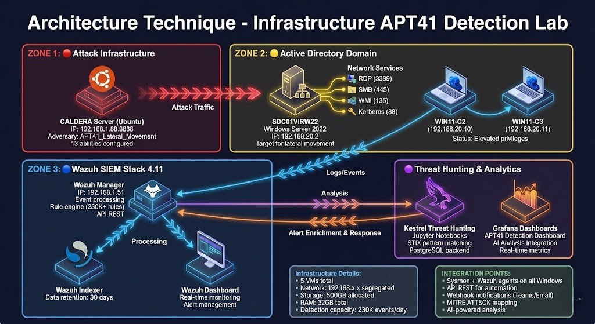

# Détection des Techniques de Mouvement Latéral du Groupe APT41

[](https://www.usherbrooke.ca/)
[](./tex/main.pdf)
[](https://attack.mitre.org/)

## 🏗️ Architecture du Système de Détection

<div align="center">



*Architecture complète du système de détection APT41 intégrant CALDERA, Wazuh, Kestrel et SOAR*

</div>

---

## 📋 Informations du Projet

**Cours:** INF808 - Réaction aux attaques et analyses des attaques
**Programme:** Maîtrise en Cybersécurité
**Institution:** Université de Sherbrooke (UDS)
**Session:** Automne 2025
**Professeur:** Daniel Migault

<div align="center">


[](http://www.youtube.com/watch?v=R2k0KiZuqcE "Wazuh & Grafana Real-time Detection - Click to Watch!")

**🎥 Cliquez sur le lien la pour regarder la démo complète sur YouTube**

*Architecture complète du système de détection APT41 intégrant CALDERA, Wazuh, Kestrel et SOAR*

</div>


**🎥 Cliquez sur le lien la pour regarder la présentation en ligne** :  [La Présentation web](https://pca-mtl.helpforinfo.com/inf808)


## 🎯 Problématique

Le mouvement latéral constitue une phase critique de la chaîne d'attaque permettant aux attaquants de progresser au sein des réseaux compromis. Le groupe **APT41** (Double Dragon / Winnti Group) excelle dans l'utilisation de techniques de mouvement latéral qui exploitent des protocoles légitimes de Windows, rendant leur détection particulièrement difficile.

Ce projet vise à développer et évaluer un système de détection complet basé sur l'émulation d'adversaire et l'analyse comportementale pour identifier les techniques de mouvement latéral d'APT41.

## 🚀 Objectifs

1. **Établir un profil détaillé** du groupe APT41 et de ses techniques d'attaque
2. **Développer des règles de détection** pour Wazuh et Kestrel
3. **Implémenter un système SOAR** pour l'automatisation de la réponse
4. **Créer des tableaux de bord** avec Grafana pour la visualisation
5. **Modéliser les menaces** avec STIX 2.1 et MITRE ATT&CK

## 📂 Structure du Projet

```
pj-enlm-25a-1-main/
│
├── tex/                              # Documentation LaTeX principale
│   ├── main.tex                      # Document principal
│   ├── main.pdf                      # Rapport compilé (PDF)
│   ├── etatart.tex                   # État de l'art
│   ├── architecture_section.tex     # Architecture du système
│   ├── regles_wazuh_section.tex     # Règles de détection Wazuh
│   ├── detection_queries_section.tex # Requêtes de détection Kestrel
│   ├── automation_soar_section.tex  # Automatisation SOAR
│   ├── kestrel_section.tex          # Threat Hunting avec Kestrel
│   ├── appendix.tex                 # Annexes
│   ├── bib.bib                      # Références bibliographiques
│   │
│   ├── figures/                     # Images et diagrammes
│   │   ├── Architecture.jpg
│   │   ├── caldera_*.png           # Captures CALDERA
│   │   ├── Grafana_AI_Dash*.png    # Tableaux de bord Grafana
│   │   ├── Kestrel_console*.png    # Interface Kestrel
│   │   ├── InfraAPT41.png          # Infrastructure APT41
│   │   ├── validate_stix_apt41.py  # Script validation STIX
│   │   └── stix_json_apt41.json    # Rapport STIX APT41
│   │
│   └── stix_json_apt41/            # Données threat hunting
│       ├── APT41ThreatHuntingNotebook.ipynb
│       ├── apt41_incident_response.ipynb
│       ├── apt41_hunt.hdf          # Données de chasse
│       ├── apt41_report_*.html     # Rapports HTML
│       └── remediation_*.ps1       # Scripts de remédiation
│
├── ref/                             # Références bibliographiques
│   └── references.bib
│
├── README.md                        # Ce fichier
└── Misha_Belisle___Blaine_Jeffries_-_Emulating_Adversary_Actions_in_the_Operational_Environment_with_Caldera_OT.pdf
```

## 🛠️ Technologies et Outils

### Simulation d'Attaques
- **CALDERA OT**: Framework d'émulation d'adversaire (MITRE)
- **Atomic Red Team**: Tests d'attaque atomiques

### Détection et Monitoring
- **Wazuh**: SIEM open-source pour la détection des menaces
- **Sysmon**: Monitoring système Windows
- **Kestrel**: Langage de threat hunting

### Automatisation et Orchestration
- **SOAR**: Automatisation de la réponse aux incidents
- **Python**: Scripts d'automatisation

### Visualisation
- **Grafana**: Tableaux de bord et visualisation
- **Jupyter Notebooks**: Analyse interactive

### Modélisation des Menaces
- **STIX 2.1**: Structured Threat Information Expression
- **MITRE ATT&CK**: Framework de techniques d'attaque
- **OCSF**: Open Cybersecurity Schema Framework

## 🎭 Techniques APT41 Couvertes

Le projet se concentre sur 5 techniques principales de mouvement latéral et d'authentification :

| Technique MITRE | Description | Outil | Catégorie |
|----------------|-------------|-------|-----------|
| **T1021.001** | Remote Desktop Protocol (RDP) | mstsc.exe | Lateral Movement |
| **T1021.002** | SMB/Windows Admin Shares + PsExec | psexec.exe | Lateral Movement |
| **T1047** | Windows Management Instrumentation (WMI) | wmic.exe | Lateral Movement |
| **T1550.002** | Use Alternate Authentication - Pass the Hash | Mimikatz | Credential Access |
| **T1550.003** | Use Alternate Authentication - Pass the Ticket | Mimikatz | Credential Access |

## 📊 Architecture du Système

Le système implémenté comprend :

1. **Environnement de Simulation**: Machines Windows cibles avec agents CALDERA
2. **Collecte de Logs**: Wazuh agents + Sysmon
3. **Détection**: Règles Wazuh + Requêtes Kestrel
4. **Automatisation**: Workflows SOAR
5. **Visualisation**: Dashboards Grafana

## 📖 Compilation du Rapport

### Prérequis
- Distribution LaTeX (TeX Live, MiKTeX)
- Biber (pour la bibliographie)

### Compilation
```bash
cd tex/
pdflatex main.tex
biber main
pdflatex main.tex
pdflatex main.tex
```

Ou avec latexmk :
```bash
cd tex/
latexmk -pdf main.tex
```

Le PDF final sera généré : `tex/main.pdf`

## 🔬 Notebooks Jupyter

### APT41 Threat Hunting Notebook
Localisation : `tex/stix_json_apt41/APT41ThreatHuntingNotebook.ipynb`

Ce notebook contient :
- Requêtes Kestrel pour la détection APT41
- Analyse des IoCs (Indicators of Compromise)
- Corrélation des événements de mouvement latéral
- Visualisation des résultats de chasse

### APT41 Incident Response Notebook
Localisation : `tex/stix_json_apt41/apt41_incident_response.ipynb`

Ce notebook contient :
- Playbooks de réponse aux incidents
- Scripts de remédiation automatisés
- Analyse forensique post-incident

## 🔍 Validation STIX

Le rapport STIX 2.1 peut être validé avec :

```bash
# Installation du validateur
pip install stix2-validator

# Validation
cd tex/figures/
python validate_stix_apt41.py
stix2_validator stix_json_apt41.json
```

## 📈 Tableaux de Bord Grafana

Les dashboards Grafana intègrent :
- Détection temps réel des techniques APT41
- Alertes automatiques par sévérité
- Visualisation des mouvements latéraux
- Métriques de performance du SIEM

Captures disponibles dans `tex/figures/Grafana_AI_Dash*.png`

## 🤝 Contribution et Suivi

- Gestion de projet : GitHub
- Contributions : via commits Git
- Suivi : bihebdomadaire/mensuel
- Évaluation : Personnelle (contributeurs identifiés par commits)

## 📚 Références Principales

- FireEye (2019). APT41: A Dual Espionage and Cyber Crime Operation
- Mandiant (2020). APT41 Compromises US State Governments
- MITRE ATT&CK (2024). APT41 Group Profile (G0096)
- Google TAG (2024). DUSTTRAP Campaign Report
- US DOJ (2020). Indictment of APT41 Members

## 📄 Licence

Ce projet est réalisé dans un cadre académique à l'Université de Sherbrooke.

## 👥 Auteurs

Voir `tex/preambule.tex` pour la liste des étudiants contributeurs.

## 📧 Contact

Pour toute question concernant ce projet :
- Professeur : Daniel Migault
- Cours : INF808 - Université de Sherbrooke

---

**Note**: Ce projet fait partie d'un travail de recherche académique en cybersécurité. Les techniques et outils présentés sont utilisés dans un contexte éthique et légal d'apprentissage et de défense.
